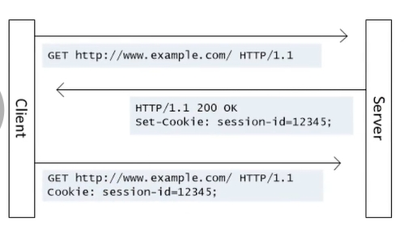

## 链接

https://developer.mozilla.org/zh-CN/docs/Web/HTTP/Cookies
https://en.wikipedia.org/wiki/HTTP_cookie

## cookie 模型

 

> 在 _stateless_ 的 _http_ 提供了 _session layer_ `HTTP State Management Mechanism`

1. 响应报文中的 cookie 首部字段
2. 请求报文中的 cookie 首部字段
3. 客户端保存 cookie 文件，由浏览器管理
4. 服务端存储 cookie 的表项，当有 cookie 时执行 cookie 特定操作

> RFC 中 cookie 小于 4kb

## cookie 使用

> cookie 与 seesion 相结合，session 是服务器端维护的会话状态

- `set-cookie`: SP set-cookie-string  *(cookie-av)
    - `cookie-av`: expires-av | max-age-av | domain-av | path-av | secure-av | http-only-av | same-site-av | comment-av

- `cookie`: SP cookie-string *(cookie-pair)

## session 使用

`set-cookie: session=xxxx`

## HTTP 中的状态管理
