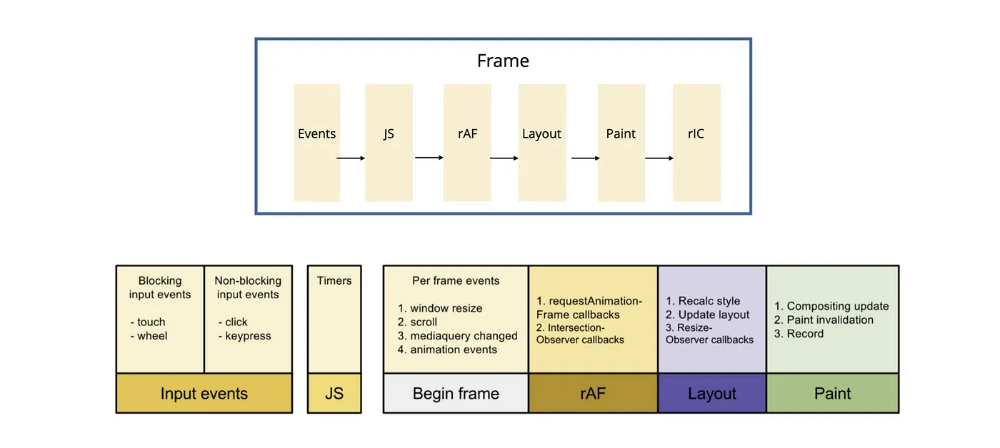

tags:: react

-
-
- `Fiber` : `JSX -> React Element -> Fiber Node` (`Link List traversal`)
- `Reconciler` : `diff -> render-> commit`
	- 兩個不同類型的 element 會產生出不同的 tree
	  logseq.order-list-type:: number
	- ==開發者可以通過 key prop 來指出哪些 child elements 在不同的 render 下可以保持不變。==
	  logseq.order-list-type:: number
- `Scheduler` : `Scheduler -> Reconciler -> Renderer`
	- 调度任务优先级
	-
-
- {:height 569, :width 1250}
-
-
-
-
-