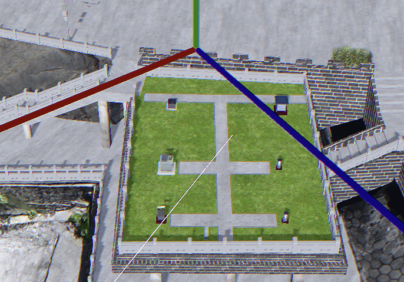
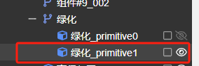

category:: sssn

-
- `Brush Hedge Tree` 这三个模型可以单独导出发我下
  logseq.order-list-type:: number
- 雨量场这里绿化要单独选中，现在所有绿化都在 `绿化_primitive1` 里，雨量场这里可以分开
  logseq.order-list-type:: number
- {:height 487, :width 686} 
  logseq.order-list-type:: number
- 水位台内部最好还是单独的模型文件，需要切换场景，和外部分开
  logseq.order-list-type:: number
-