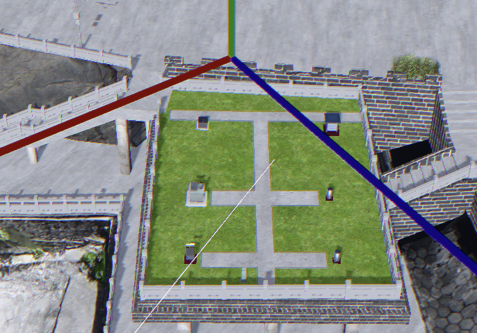
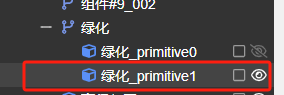
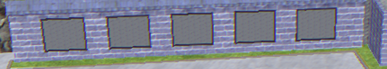
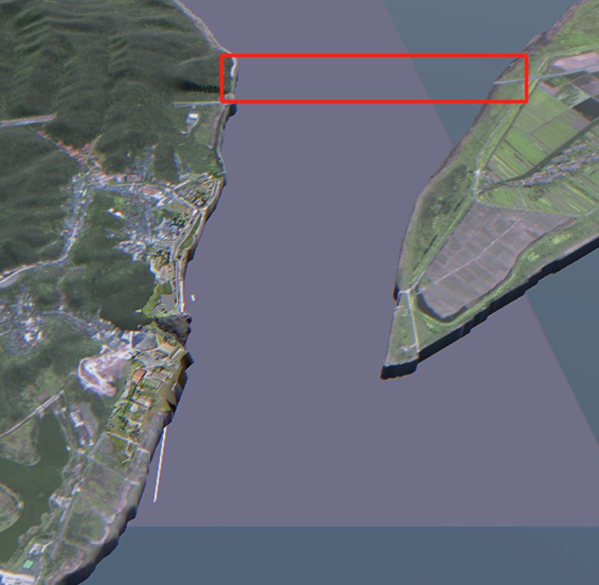
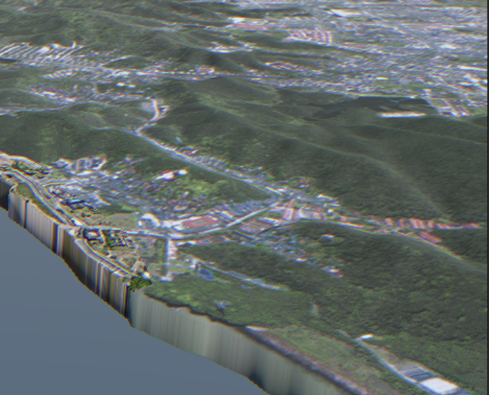
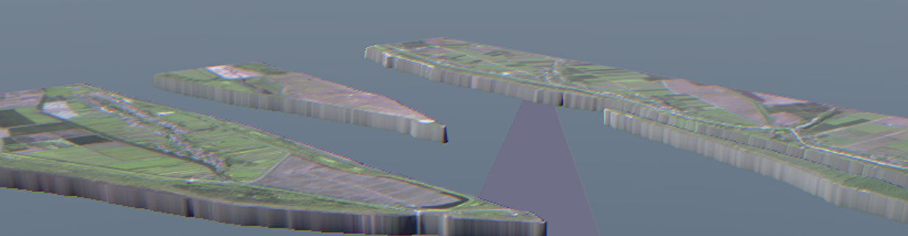
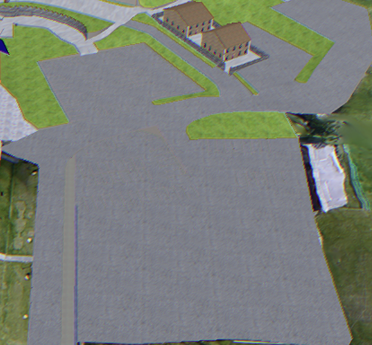
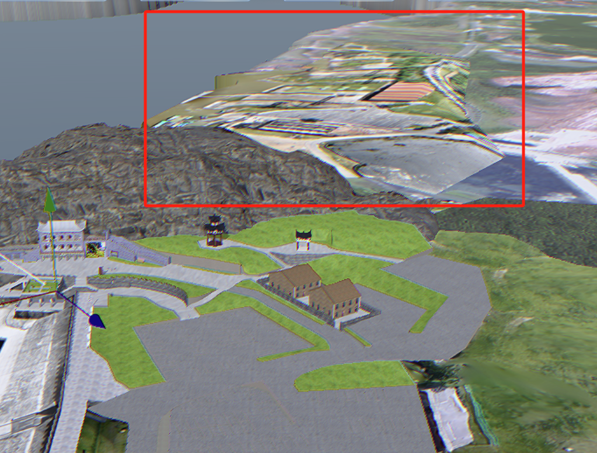
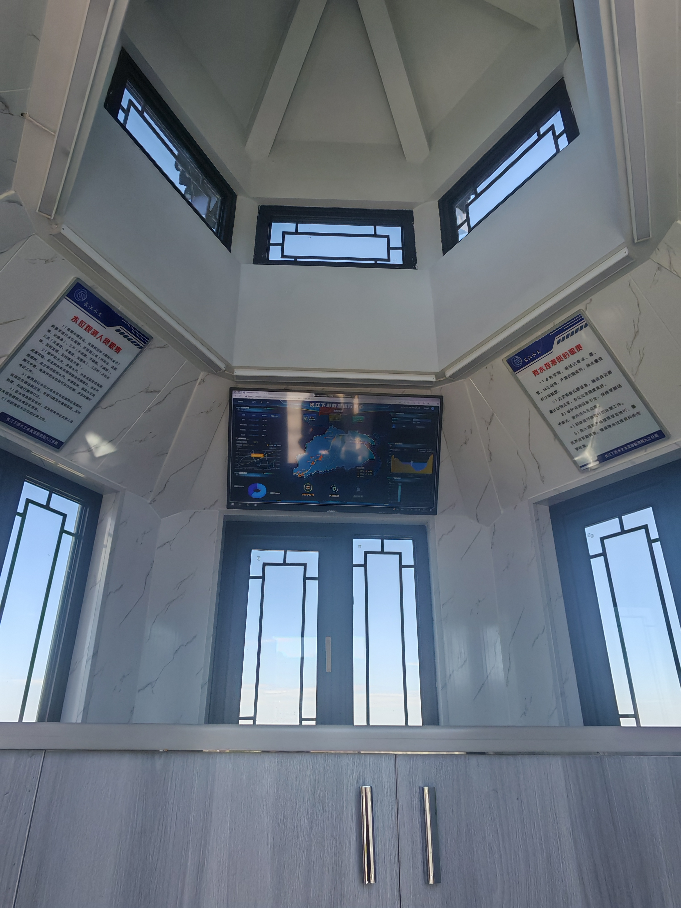

category:: sssn

-
- ### 0812 模型问题
- `Brush Hedge Tree` 这三个模型可以单独导出发我下
  logseq.order-list-type:: number
- 雨量场这里绿化要单独选中，现在所有绿化都在 `绿化_primitive1` 里，雨量场这里可以分开
  logseq.order-list-type:: number
- {:height 487, :width 686} 
  logseq.order-list-type:: number
- 水位台内部最好还是单独的模型文件，需要切换场景，和外部分开
  logseq.order-list-type:: number
-
- ### 0814 模型问题
- 缺少江面测流船，可以发独立的测流传 glb 文件
  logseq.order-list-type:: number
- 缺少壁画贴图 
  logseq.order-list-type:: number
- 船身橙黄色替换成淡蓝色 
  logseq.order-list-type:: number
- 中间加一座桥 
  logseq.order-list-type:: number
	- assets:///Z%3A/home/wangzhx/Github/confucianism/logseq/assets/image_1723620539711_0.png
- 江心和对岸地形 可否像这样有起伏  
  logseq.order-list-type:: number
- 停车场加几辆车或者标注线 
  logseq.order-list-type:: number
- 这里可否加一些白膜建筑 
  logseq.order-list-type:: number
- 室内模型缺少贴图 {:height 768, :width 958}
  logseq.order-list-type:: number
-
- ### 本周计划
- DONE 流域场景 测站场景切换 （相机动画功能封装）
  logseq.order-list-type:: number
- TODO 冲淤分析模块 时间轴 图例
  logseq.order-list-type:: number
- DONE 视频交互完成 （根据模型创建相同大小平面 视频播放 放大逻辑）
  logseq.order-list-type:: number
- DONE 视频交互提示 （添加鼠标悬浮提示组件）
  logseq.order-list-type:: number
- DONE 加载动画和加载进度判断
  logseq.order-list-type:: number
- DONE 单个模型点击交互，设置其他模型纹理 （根据模型 ID）
  logseq.order-list-type:: number
- TODO 单个模型交互时相机距离 角度确定 (相机动画增加多个参数)
  logseq.order-list-type:: number
- DONE 调整新模型阴影（根据模型 ID）
  logseq.order-list-type:: number
- DONE 添加模型水面和反射（根据模型 ID）
  logseq.order-list-type:: number
- DONE 水位高度控制  以及监听水面相关高度模型 （设置根据水面高度调整位置的船模型）
  logseq.order-list-type:: number
- DONE 对接模型整理问题
  logseq.order-list-type:: number
- TODO 大坝 警戒水位 保证水位线展示和交互（具体位置之后再调整）
  logseq.order-list-type:: number
	- DONE 添加线段
	  logseq.order-list-type:: number
	- TODO 调整位置
	  logseq.order-list-type:: number
	- logseq.order-list-type:: number
-
- ### 下周计划
- TODO 下游局综合管理平台 数字流域添加湖口跳转，湖口水文站添加回退到数字流域
- TODO 下游局综合管理平台跳转 token 进行身份验证
- TODO 水位断面 流量断面线展示和交互
- TODO 水位线交互以及跳转水面到对应水位线
-