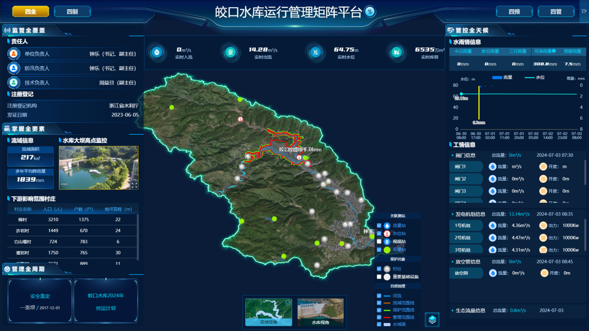

## 工程相关
- 使用浏览器路由 （`vue router` 实现）
  logseq.order-list-type:: number
- 使用 `@vueuse/core`
  logseq.order-list-type:: number
	- 精度设置
	  logseq.order-list-type:: number
	- 全局状态 （测站编码等）
	  logseq.order-list-type:: number
-
- ### 集成数字流域
- 单独开发部署 （下游局综合管理平台统一登录）
  logseq.order-list-type:: number
- 持续部署 （CD 推送部署到内部环境）
  logseq.order-list-type:: number
-
- ## 项目相关
-
- https://doc.babylonjs.com/features/featuresDeepDive
-
- > 大比例尺场景
-
- ### 场景数据
- 静态模型数据 (单独静态服务)
  logseq.order-list-type:: number
- 动态数据
  logseq.order-list-type:: number
- 预处理资源 （纹理，图片）
  logseq.order-list-type:: number
- 空间数据 （流场 冲淤 EPSG ID）
  logseq.order-list-type:: number
-
- ### 场景坐标
- 投影坐标原点 固定比例 （模型未必可以按照比例设置）
  logseq.order-list-type:: number
- 高度坐标原点 固定比例标准
  logseq.order-list-type:: number
- 开发环境下设置标尺。XZ 方向标尺，单位 1 对应多少度；Y 方向标尺，单位 1 对应多少米；
  logseq.order-list-type:: number
- 正方向
  logseq.order-list-type:: number
-
- ### 场景视角
- 热点点击  （`ActionManager`）
  logseq.order-list-type:: number
- 相机限制  （`Limit` 限制角度 `Behavior` 自动旋转）
  logseq.order-list-type:: number
- 场景漫游
  logseq.order-list-type:: number
- 内部视角：
  logseq.order-list-type:: number
	- 水文站视角
	  logseq.order-list-type:: number
	- 流域视角
	  logseq.order-list-type:: number
-
- ### 场景光照
- 统一环境光
  logseq.order-list-type:: number
- 日光 （`SkyMaterial `+ `SunPosition` + `Cloud`）
  logseq.order-list-type:: number
- 场景光照 具体调整
  logseq.order-list-type:: number
	- 每一个场景需要的具体光照
	  logseq.order-list-type:: number
- 体积光 （补充效果）
  logseq.order-list-type:: number
- 必要的阴影
  logseq.order-list-type:: number
-
- ### 场景模拟
- 时间
  logseq.order-list-type:: number
- 天气
  logseq.order-list-type:: number
- 环境
  logseq.order-list-type:: number
- 是否实时
  logseq.order-list-type:: number
-
- ### 场景交互
- 数据查看
  logseq.order-list-type:: number
- 数据编辑 （持久化交互）
  logseq.order-list-type:: number
- 数据管理 （持久化存储）
  logseq.order-list-type:: number
- logseq.order-list-type:: number
- ### 场景水位
- 关联水位的模型 （ `Observables` ）
  logseq.order-list-type:: number
- 水下处理 （`PostProcesses`）
  logseq.order-list-type:: number
- 水位模拟 （和保证 警戒水位相关）
  logseq.order-list-type:: number
-
- ### 室内场景
- 360 照片 https://doc.babylonjs.com/features/featuresDeepDive/environment/360PhotoDome
  logseq.order-list-type:: number
- 室内模型
  logseq.order-list-type:: number
-
- ### 数据模拟
- > 小比例尺场景
- 最大限定到鸟瞰视角，支持切换到数字流域
- 或者像城陵矶雨量分析，插入弹窗的小比例尺场景，或者流域视角和水文站视角
-
- 
-
- 这种流域视角存储的站点、边界需要空间数据支持，使用 `mapbox`
-
- ### 数据分析
- > 默认分析模块使用 `BABYLON` 实现冲淤、叠加
-
- 流场：在宣城实现上优化
- 水位：增加历史洪水，倒灌
- 断面：断面数据地形
-